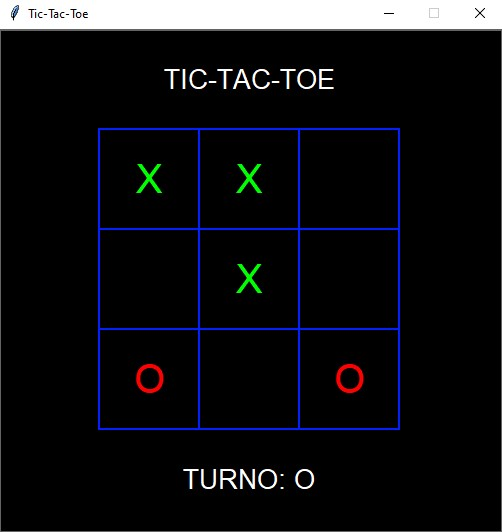
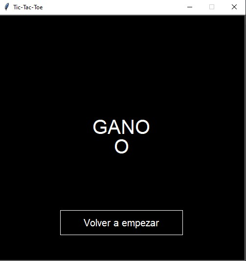

# TATETI

# Archivos
* main.py: archivo principal donde se ejecuta el desarrollo del juego.

SRC:
  * tateti.py: contiene las funciones encargadas de la lógica del juego.

GRAPHICS:
  * gamelib.py: librería utilizada para crear la interfaz gráfica y algunos procesos del juego.
  * inter_grafica.py: contiene las funciones gráficas creadas a partir de la librería gamelib para crear la interfaz gráfica.
 
 IMG:
  * imágenes de muestra del juego.

# Gráficos
La interfaz gráfica se creo utilizando la librería extraída [Gamelib](https://github.com/dessaya/python-gamelib)

